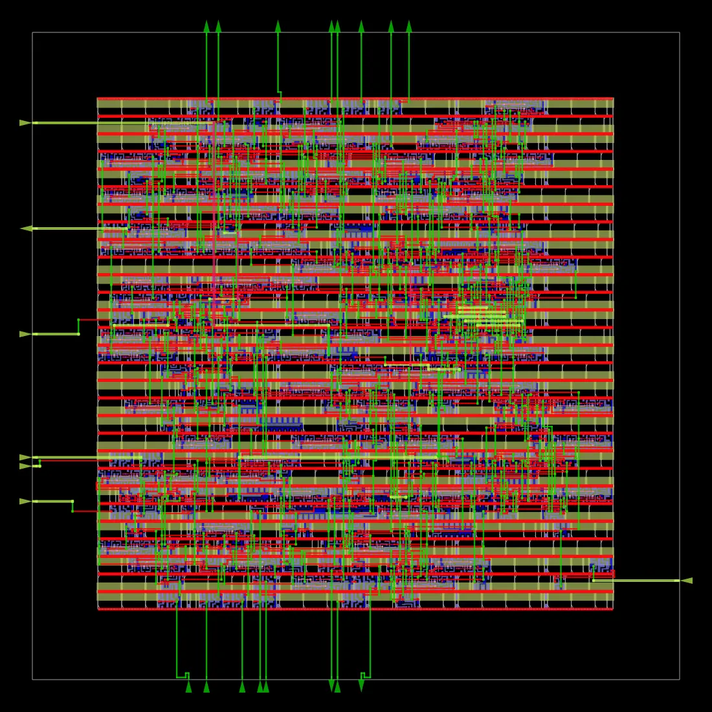

# UART-Design-and-RTL-to-GDS-Implementation-using-OpenROAD
This project implements a UART in Verilog with FSM-based transmitter, receiver, and baud generator. Pipelining improves timing performance. It demonstrates full RTL-to-GDS flow using OpenROAD, including synthesis, placement, CTS, routing, and timing analysis, along with the commands required to run the flow.

---

## Key Features
- UART design using Verilog (TX + RX + Baud Generator)
- FSM-based architecture
- Pipelined design for improved timing
- 16x oversampling technique
- Full RTL-to-GDS flow using OpenROAD

---

## Architecture
The design consists of:
- Baud Rate Generator
- UART Transmitter (FSM-based)
- UART Receiver (FSM-based with synchronization)
- Top module integrating all blocks

---

## OpenROAD Flow
The design is implemented using OpenROAD RTL-to-GDS flow:

- Synthesis  
- Floorplanning  
- Placement  
- Clock Tree Synthesis (CTS)  
- Routing  
- Timing Analysis  

Technology: Sky130HD  
Platform: Linux  

---

## How to Run (Adding UART Design to ORFS)

This section explains how to integrate and run the UART design using OpenROAD-flow-scripts (ORFS).

### Step 1: Add Verilog Source Files
```
cd designs/src  
mkdir uart_new  
cd uart_new  
vi uart.v
```

Paste UART RTL code.

---

### Step 2: Create Config File
```
cd ../../sky130hd  
mkdir uart_new  
cd uart_new  
vi config.mk  
```
Add:
```
export PLATFORM = sky130hd
export DESIGN_NAME = uart_new

export VERILOG_FILES = ./designs/src/uart_new/uart.v
export SDC_FILE = ./designs/sky130hd/uart_new/constraint.sdc

export DIE_AREA = 0 0 500 500
export CORE_AREA = 50 50 450 450
```
---

### Step 3: Add Constraints
vi constraint.sdc  

```
current_design uart_top

set clk_name core_clock
set clock_port_name clk

set clk_period 1.7
set clk_io_pct 0.2

set clk_port [get_ports clk]
create_clock -name core_clock -period 1.7 [get_ports clk]

set non_clock_inputs [all_inputs -no_clocks]

set_input_delay [expr $clk_period * $clk_io_pct] -clock $clk_name $non_clock_inputs
set_output_delay [expr $clk_period * $clk_io_pct] -clock $clk_name [all_outputs]
```

---

### Step 4: Run Flow
```
make DESIGN_CONFIG=./designs/sky130hd/uart_new/config.mk
```
---

## Project Structure

- `rtl/` → Verilog design  
- `config/` → OpenROAD config  
- `constraints/` → SDC file  
- `results/` → Final outputs  
- `reports/` → Reports  

---

## 📊 Results & Design Flow
  
### Floorplan
- Output: `2_floorplan.odb`
  

### Placement
- Output: `3_place.odb`  


### Clock Tree Synthesis (CTS)
- Output: `4_cts.odb`

### Routing
- Output: `5_route.odb`  


### Final Design
- Outputs: `6_final.def`, `6_final.gds`, `6_final.v`

<p align="center">
  
  
</p>

---

This demonstrates the complete RTL-to-GDS flow using OpenROAD, covering all stages from synthesis to final physical design.

---

## Tools Used
- Verilog HDL  
- OpenROAD  
- OpenROAD-flow-scripts  
- Linux  

---

## Author
Rajesh Kumar  
Digital VLSI | RTL Design | FPGA | OpenROAD
