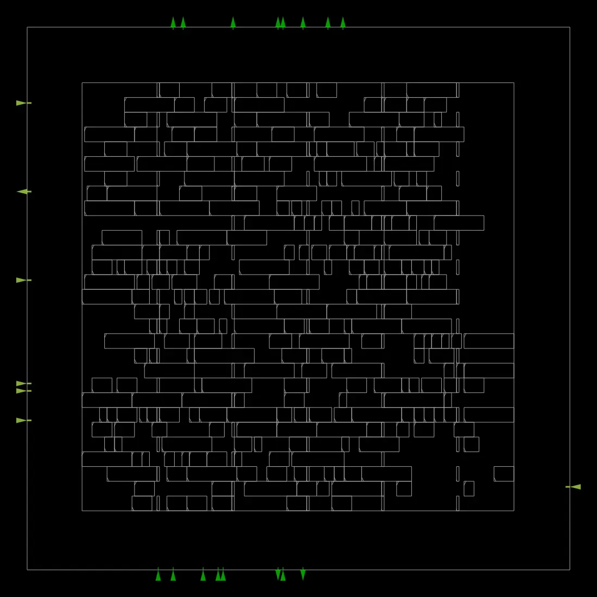

# UART-Design-and-RTL-to-GDS-Implementation-using-OpenROAD
This project implements a UART in Verilog with FSM-based transmitter, receiver, and baud generator. Pipelining improves timing performance. It demonstrates full RTL-to-GDS flow using OpenROAD, including synthesis, placement, CTS, routing, and timing analysis, along with the commands required to run the flow.

# UART-Design-and-RTL-to-GDS-Implementation-using-OpenROAD

This project implements a UART in Verilog with FSM-based transmitter, receiver, and baud generator. Pipelining improves timing performance. It demonstrates full RTL-to-GDS flow using OpenROAD, including synthesis, placement, CTS, routing, and timing analysis, along with the commands required to run the flow.

---

## 🚀 Key Features
- UART design using Verilog (TX + RX + Baud Generator)
- FSM-based architecture
- Pipelined design for improved timing
- 16x oversampling technique
- Full RTL-to-GDS flow using OpenROAD

---

## 🧠 Architecture
The design consists of:
- Baud Rate Generator
- UART Transmitter (FSM-based)
- UART Receiver (FSM-based with synchronization)
- Top module integrating all blocks

---

## 🛠️ OpenROAD Flow
The design is implemented using OpenROAD RTL-to-GDS flow:

- Synthesis  
- Floorplanning  
- Placement  
- Clock Tree Synthesis (CTS)  
- Routing  
- Timing Analysis  

Technology: Sky130HD  
Platform: Linux  

---

## ▶️ How to Run (Adding UART Design to ORFS)

This section explains how to integrate and run the UART design using OpenROAD-flow-scripts (ORFS).

### Step 1: Add Verilog Source Files
cd designs/src  
mkdir uart_new  
cd uart_new  
vi uart.v  

Paste UART RTL code.

---

### Step 2: Create Config File
cd ../../sky130hd  
mkdir uart_new  
cd uart_new  
vi config.mk  

Add:

export PLATFORM = sky130hd
export DESIGN_NAME = uart_new

export VERILOG_FILES = ./designs/src/uart_new/uart.v
export SDC_FILE = ./designs/sky130hd/uart_new/constraint.sdc

export DIE_AREA = 0 0 500 500
export CORE_AREA = 50 50 450 450

---

### Step 3: Add Constraints
vi constraint.sdc  

create_clock -period 20 [get_ports clk]
set_input_delay 2 -clock clk [all_inputs]
set_output_delay 2 -clock clk [all_outputs]

---

### Step 4: Run Flow
make DESIGN_CONFIG=./designs/sky130hd/uart_new/config.mk

---

## 📁 Project Structure

rtl/ → Verilog design
config/ → OpenROAD config
constraints/ → SDC file
results/ → Final outputs
reports/ → Reports

---

## 📊 Results

### Placement

### Routing

---

## 🔧 Tools Used
- Verilog HDL  
- OpenROAD  
- OpenROAD-flow-scripts  
- Linux  

---

## 📌 Author
Rajesh Kumar  
Digital VLSI | RTL Design | FPGA | OpenROAD
